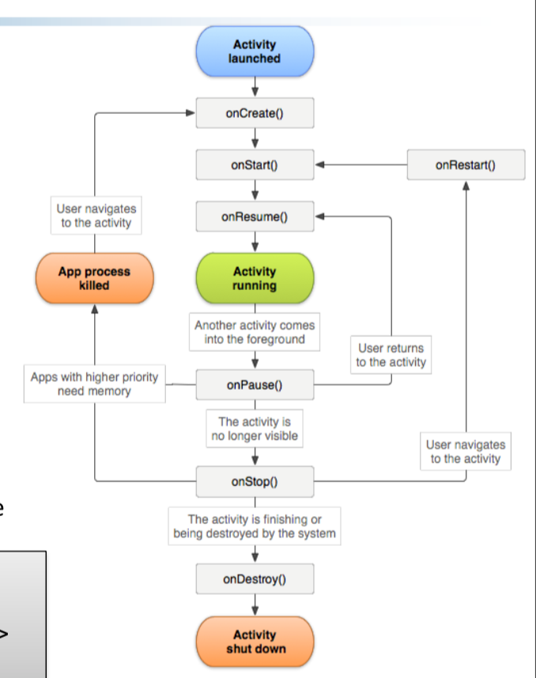
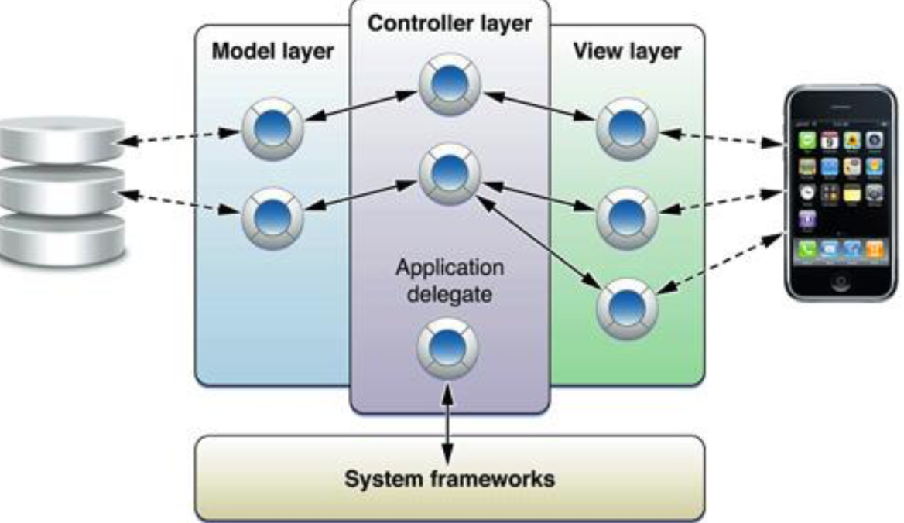
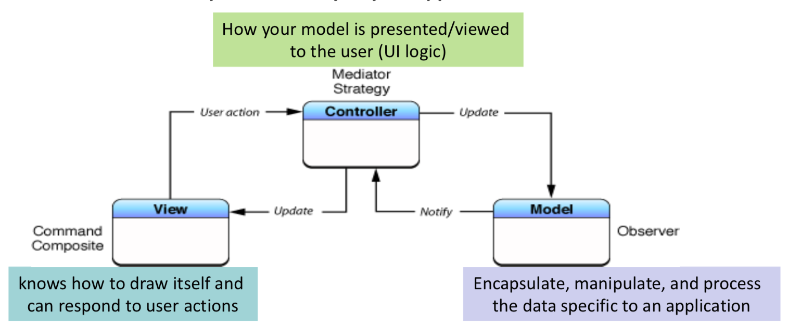
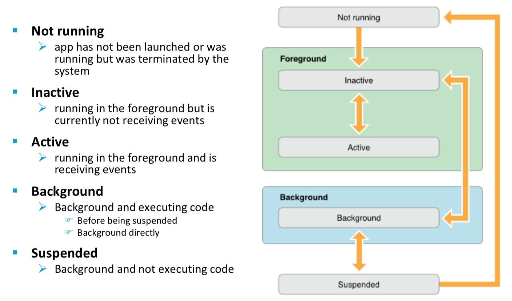
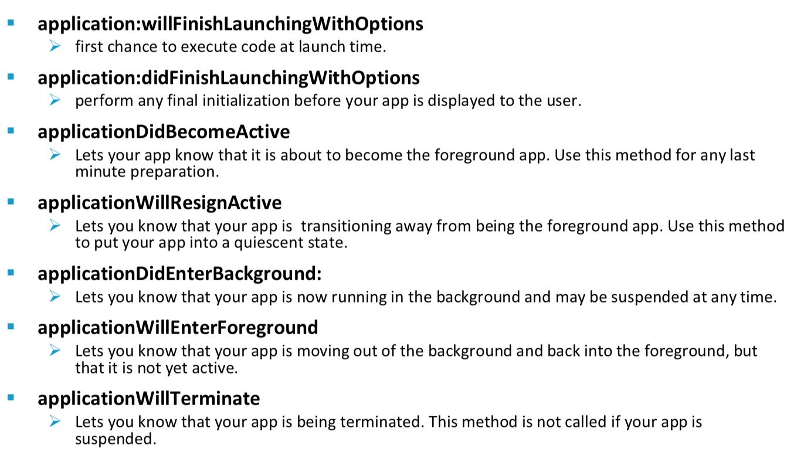
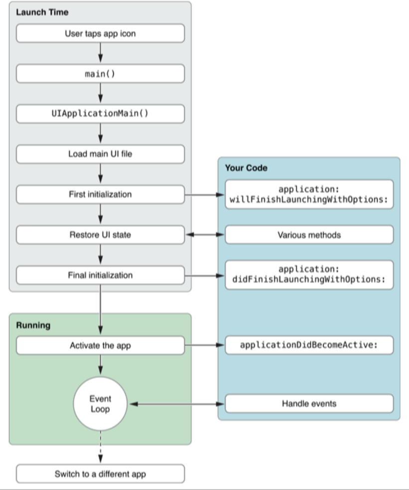
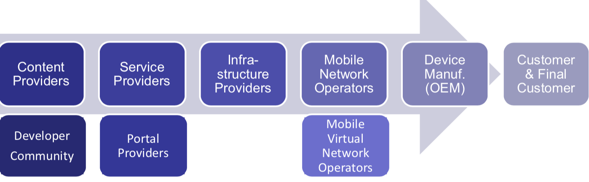
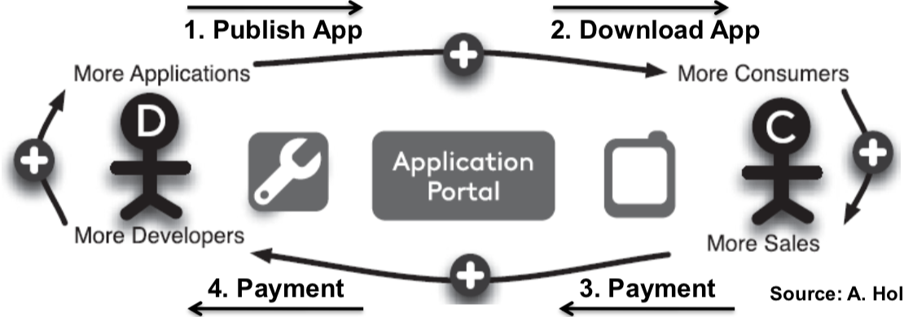

%MobServ Notes
%Andrea Palmieri

# 1. Mobile app landscape

APPLICATION = APPLICATION SERVICES (COMPUTE,STORAGE) + MANAGEMENT SERVICES(NETWORK,DB)

- **Native app** = written specifically for some platform (Java, Swift). (+) performances, UX and security (-) users limited to specific platform, high cost and long time of development
- **Web app** = Written using web standards and compatible across platforms. (+) Good UX, low cost of development, maximize users and quick to develop (-) not high quality and security relies on browser
- **Hybrid app** = Write once, compiled everywhere using webkit to link with specific API. (+) Large user base, low costs and quick to develop (-) Bad UX and quality

**Revenues approaches:** Paid, in-app purchase, advertising, freemium
**Context aware**: User, Device,Time/space and environment to make the app aware of the context and improve the experience.

# 2. Android

Based on custom Linux OS, including new libraries, custom VM and java application framework.

**Development phases**=Setup, develop, debug and test (iterating) and publish.

Features: Application framework (reuse of components), integrated browser, 2D and 3D graphics libraries, media support, connectivity, sensors..

**Android stack**
1. Apps (system and not), each in its sandbox
2. Java API framework = Content provider, view system and Managers (Activity manager, package manager, location manager, notification manager...)
3. Native C/C++ Libraries (SQLite, Libc..) + Android runtime ART, every app has its own process and instance of Dalvik VM.
4. Hardware abstraction layer (audio, camera, bluetooth..)
5. Kernel (drivers)

**Android components**

- Activities: object which has a life cycle and perform some actions. It provides a screen (view) for the user interaction. Task is a collection of activities that user interact with when performing a certain job (from home to LIFO)
- Services: Component without UI used in the background (ex. media player). It can be part of its own process or in the context of another application's process.
- Content Providers: Manages access to data on the device and share data between applications (ex. list of contacts). Use of unique URI to identify data in a provider.
- Broadcast receivers: a component that responds to system-wide broadcast (even handler) initiated by other application or by the system (ex. battery is fully charged).

**Other important stuff**

- Views: object that knows how to draw itself on the screen.
- Fragments are used for a more dynamic and flexible UI designs. Represents a behavior or a portion of user interface in an Activity. A fragment must always be embedded in an activity and the fragment's lifecycle is directly affected by the host activity's lifecycle.
- Intent: used to start activities, *"intention to do something"*. Can be **implicit** (specify an action) or **explicit** (specify a target). Data can be added to the intent using `setExtra`. In the manifest, every app can declare the intent that can be handled using *intent filters*.
{ width=250px }

## Sensors

Handheld devices allow for context aware computing: Application can respond / behave differently based on contextual information (location, ambient light, user movement). Application read information from build-in sensors to adapt to user context.

**What is a sensor?** A Sensors is mainly a HW component that measure one or multiple physical environments/phenomena:
- Motion: measure acceleration forces and rotational forces along three axes (accelerometers, gravity sensors, gyroscopes, and rotational vector sensors)
- Position: measure the physical position of a device (orientation sensors and magnetometers, GPS)
- Environment: measure various environmental parameters, such as ambient air temperature and pressure, illumination, and humidity (barometers, photometers, and thermometers) 

**Virtual sensors**: Sensor may be a software-based, not physical devices, although they mimic hardware-based sensors. An algorithms that calculates a value: either based on a single hw-based sensor or by combining multiple hw-based sensors (proximity sensor and step-counter).

**Android sensor framework**:
- Determine which sensors are available on a device. Use the SensorManager to list the sensors of the device. 
- Determine an individual sensor's capabilities, such as its maximum range, manufacturer, power requirements, and resolution. Use public methods (getResolution(), getMaximumRange(), getPower(), getVendor(), getVersion())
- Acquire raw sensor data and define the minimum rate at which you acquire sensor data.
- Register and unregister sensor event listeners that monitor sensor changes.

**Best practices for sensors in Android:**
- Only gather sensor data in the foreground as apps running in the background have the following restrictions. Sensors that use the continuous reporting mode, such as accelerometers and gyroscopes, don't receive events. Sensors that use the on-change or one-shot reporting modes don't receive events. 
- Unregister sensor listeners when the app does not require the sensor data (event for a short period of time). If a sensor listener is registered and its activity is paused, the sensor will continue to acquire data and use battery resources unless you unregister the sensor.
- Don't block the onSensorChanged() method as it may be called often.
- Choose sensor delays carefully.

# 4. Golden rules

1. Decide what to build focusing on the user's needs.
2. Visit app stores to get insights of competitors. What can be improved?
3. Explore possible solutions, test and improve. Focus on targeted user base.
4. Sketch, mock-up, stories, interviews to gather feedbacks from users. The more you do, the better it is.
5. Build a basic prototype and use feedbacks.
6. Iterate the process.
7. Start coding from the interface, than backend -> Top-down approach.
8. Beta test the app and study the usability -> test before submit
9. Release and fix the bug.

# iOS

iOS has different frameworks:

- Core OS: Low level interface for operating system (kernel environment and drivers
- Core service: Fundamental system services for applications 
- Media: Technologies for creating multimedia experience
- Cocoa Touch: Basic tools and infrastructure to implement graphical, event- driven applications in iOS

Use the top-down approach to develop the app: start from audience, then focus on the purpose and the problem the app is trying to solve and the content the app should contain.

Then design the user interface: storyboard and views to define interactions and implement behaviours.

**Objective C**: extension of C with Small-talk style messaging. Designed to give C full OO programming capabilities.

**Swift**: Protocol oriented, with concise and expressive syntax.

## App definitions 

{width=250px}

- **Model-View-Controller**: design pattern that governs the overall structure of the app
- **Singletons**: only one instance of the singleton class can be created or is alive at any one time. A singleton class return the same instance every time is called. Enables global access point to resources of its class and single point of control (prevent copying and retaining instance)
- **Delegation**: One object delegate control to another object to act on its behalf; transfer information and data from one object to another. The delegating object, at the appropriate time, sends a message to the delegate object and Delegate object may respond to the message by updating the appearance or state of itself or other objects in the application, and in some cases it can return a value that affects how an impending event is handled. This is implemented by defining a protocol that encapsulates the delegated responsibilities. The main value of delegation is that it allows you to easily customize the behavior of several objects in one central object.
- **Key-valued observing**: enables an object to be notified directly when a property of another object changes. This creates a mode of communication between objects in applications designed in conformance with the Model-View-Controller design pattern. So that an object can find out what the current and prior values of a property are.
- **Target-action**: Translates user interactions with buttons and controls into code that your app can execute. An object holds the information necessary to send a message to another object when an event occurs: information (data, an action selector identifying the method to be invoked; target, identifying the object to receive the message) and event for action triggering.
- **Sandboxing**: Protect the system and other apps limiting the app's access
- **Action**: Piece of code that’s linked to an event that can occur in your app. Creating and implementing a method with an IBAction return type and a sender parameter
- **Outlet**: provide a way to reference objects from your interface
- **Control Event**: provide a way for your code to receive messages from the user interface.
- **Navigation controller**: Transition between views manages using a LIFO.

## MVC

The mvc pattern:

- Assigns objects in an application one of three roles: model, view, or controller 
- Defines the way objects communicate with each other
- Separate and allow generic view and models (they are not aware of each other and the controller)
- Controllers acts as a glue between view and model

{width=250px}

**Model**: manipulate and process data/algorithm/networking. To-one and to-many relationship with other model objects. Communicate generically using broadcast channel: Key-value observing (listen to changes) and notification (NSNotificationCenter). 

Communication example:

- User actions in the view layer that create or modify data are communicated through a controller object and result in the creation or updating of a model object.
- When a model object changes (for example, new data is received over a network connection), it notifies a controller object, which updates the appropriate view objects

**View**: Display/Event capture/Visual interaction. Know how to draw itself and user can interact with it. Generic and provides consistency between applications. Communicate generically using: Target–Action and Delegate (Will, did, should).

Communication example:
- View objects learn about changes in model data through the application’s controller objects
- User-initiated changes—for example, text entered in a text field— through controller objects to an application’s model objects.

**Controller**: coordination and delegation. Know about view and model and manages data, views and application logic (app-specific code). 

Communication example: 
- A controller object interprets user actions made in view objects and
communicates new or changed data to the model layer.
- When model objects change, a controller object communicates that new model data to the view objects so that they can display it.

## App states

{width=250px}
{width=250px}
{width=250px}

## Styles of applications

- **Productivity**: Organization and manipulation of detailed information. Multiple screens and make use of system controls to handle the navigation from screen to screen. Typically rely on system views and controls (text fields, labels, and other data-oriented views) for their presentation and do little or no custom drawing
- **Utility**: Perform a specific task that requires relatively little user input. A quick summary of information or a simple task on a small number of objects. Interface should be a visually appealing and uncluttered to make it easier to spot the needed information quickly
- **Immersive**: Offer a full-screen, visually rich environment that’s focused on the content and the user’s experience with that content.  Commonly used for implementing games and multimedia-centric applications.  Often present custom interfaces, and relies less on standard system views and controls. Typically use OpenGL ES to draw content, because it provides good performance for full-screen content at high frame rates

# Marketing strategy

**Mobile industry value chain**: With arrival of iOS and Android, the market structure and value chain have been evolved:
- Roles are changed, combined and exchanged
- Some actors lost control, i.e. mobile operators
- Other got new revenue stream, i.e. portal providers, developers
- Some become integrated into the platform, i.e. content provider

{width=250px}

## App distribution

Application markets: more apps, more use cases, network effect, simple and safe for users.

{width=250px}
**Trends**:

- Development tools: trend towards open technologies -> Low development cost
- Device: trend towards device variety -> more technical features, higher customization cost
- Portal: trend towards centralization -> less freedom, easier access to customer, lower distribution cost
- Platform: trend towards full integration -> easier development access

**Specific strategies** may not work in all situations. Consider Network effect: "the more people who use something, the more valuable it becomes".

- **Early markets**: Get the right product at the right time
- **Mature markets**: More complicated, find profitable niches, dominate and define them, figure out the cost of market share growth, attack #1 if it makes sense 
- **Fair market**: Commodity products, in level marketplace; Be better than the other do, which is very difficult
- **Unfair market (use network effect)**: Constraints dynamics, advantage on natural resources, Regulatory, access to the customer / distributors

Compete on price/value/features/scale. Leaders can be fast followers.

**Marketing**: Process to create customer interest in goods or services or to figure out what market wants or create needs. Generate the strategy for sales, business communication, and business developments.

Marketing mix:
- Product -> Solution (consumer desire): solve a need in a unique and simple way invisible to the costumer. Choose name, Unique value proposition, slogan. Product sells itself: value is apparent and solve the problem in a unique way. 
- Promotion -> Information (communication). Community leverage, network effect, pre-launch campaign.
- Price -> Value (cost).
- Place -> Access (convenience). Direct to consumers, Internet, app stores, (inter)national retail.
- People (customer approach).

**Questions to be answered by marketing**:
- What is the problem?
- How is it done today, and what are the limits of
current practice?
- What's new in your approach and why do you think it will be successful?
- Who is going to buy/use your app?
- What is your app ? Why do people value your app ?
- What is the marketing and sales strategy?

## Business models

### In-app purchase

Release you app for free, no download barrier, and reach more users, then if users enjoy your app, they can purchase more in-app functionalities

- Embed a store inside your app
+ Sell a variety of items directly within your free or paid app
+ Premium content, virtual goods, and subscriptions
- Mix of paid and free items
- Process
- connects to the AppStore on your app’s behalf to securely process payments from
users, prompting them to authorize payment
- Example
- a magazine app that lets users purchase and download new issues
- a game that offers new environments (levels) to explore
- an online game that allows players to purchase virtual property (money, etc.)

### Monetize an app

**Premium (paid app)**:
- Pure paid apps are more adequate for stable market and/or kids/ elderly users (Example: Games for kids, no ads)
- For growing market, use in-app purchase to unlock the app.

**Freemium (free app)**:
- Fee download with limited features or full features for a limited time.
- Use in-app purchase to unlock the app
- More adequate for a dynamic/new market

**Subscription**:
- Mix of paid and free (trial) subscriptions
- Periodically, and Can’t be consumed

**E-commerce**:
- Sell physical items, combine  with the premium/freemium type of app

**Ads**:
- Android Admob, iOS iAds: analyze, promote, monetize

