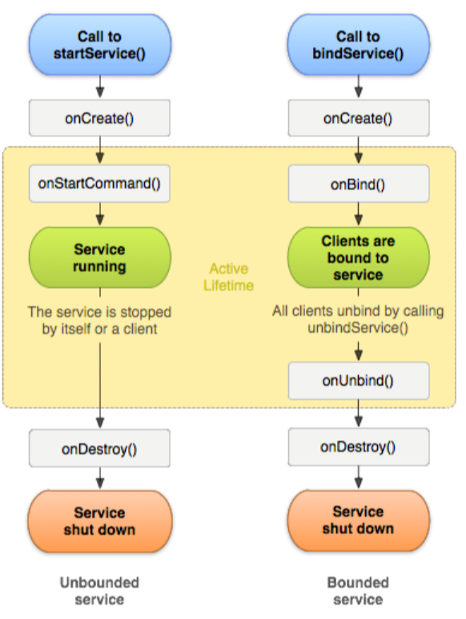
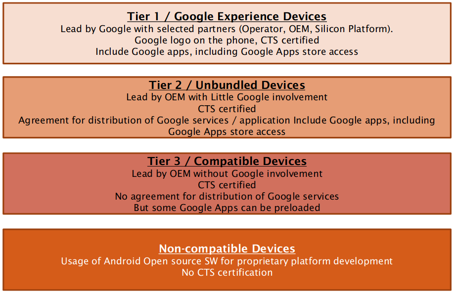
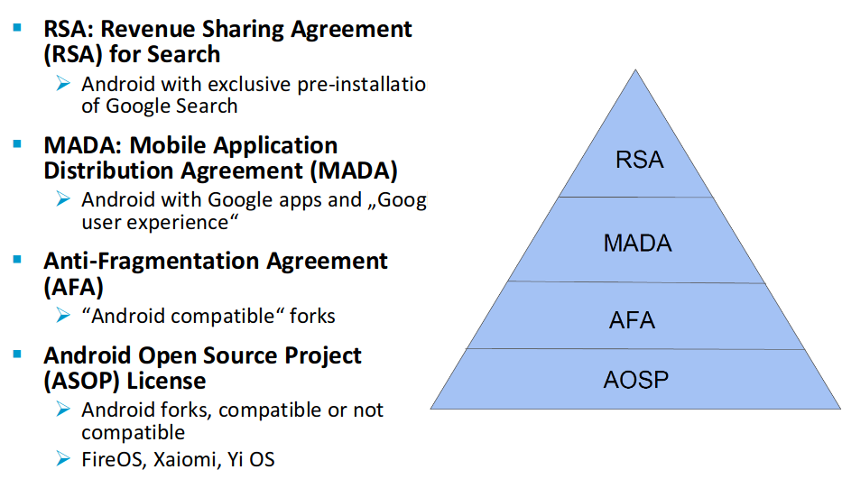
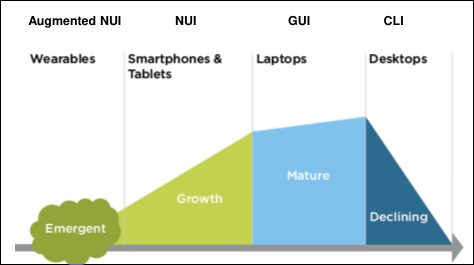
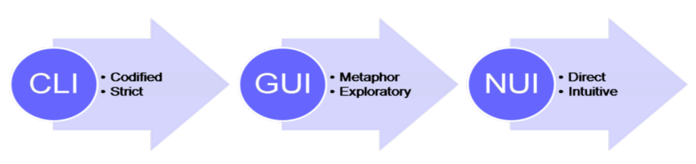
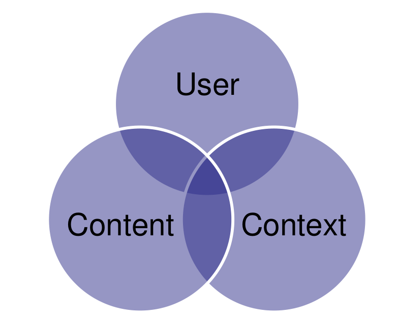
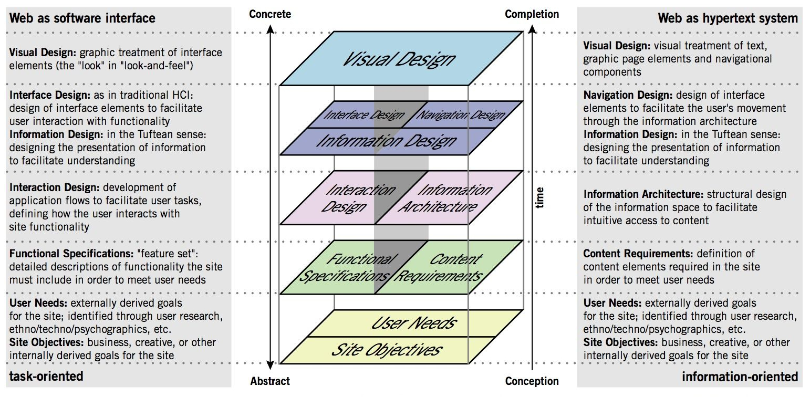
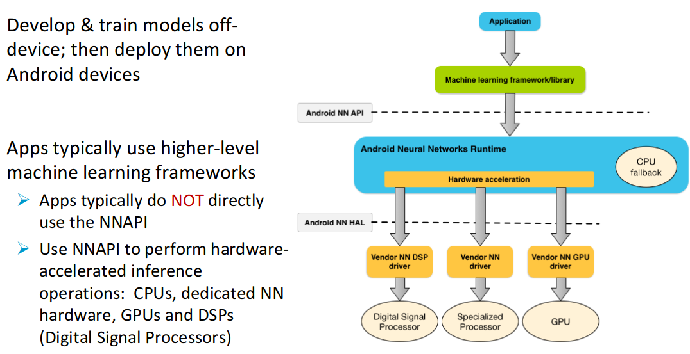
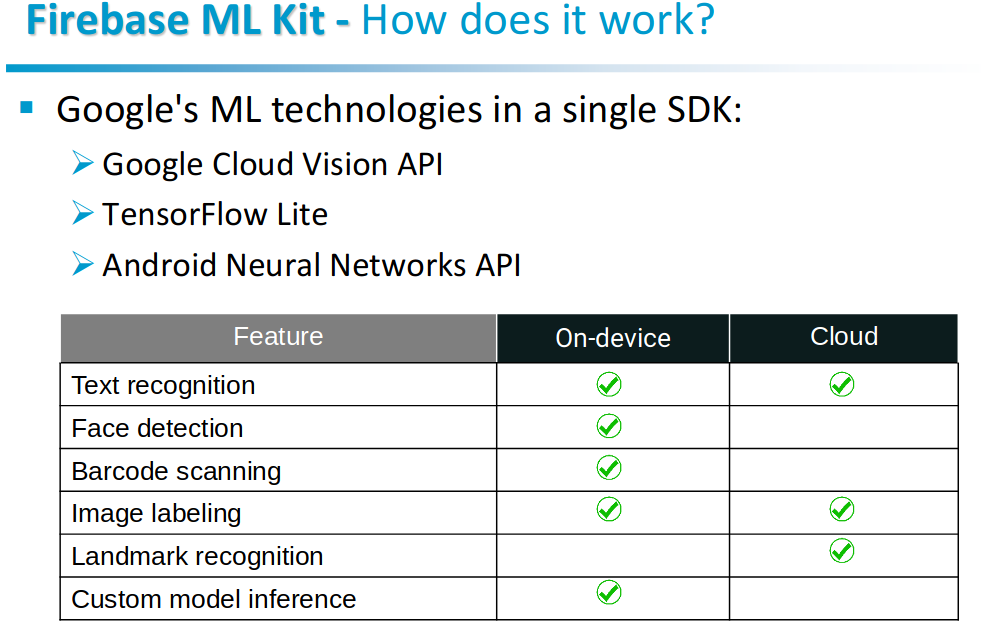

%MobServ Notes
%Andrea Palmieri

# 1. Mobile app landscape

APPLICATION = APPLICATION SERVICES (COMPUTE,STORAGE) + MANAGEMENT SERVICES(NETWORK,DB)

- **Native app** = written specifically for some platform (Java, Swift). (+) performances, UX and security (-) users limited to specific platform, high cost and long time of development
- **Web app** = Written using web standards and compatible across platforms. (+) Good UX, low cost of development, maximize users and quick to develop (-) not high quality and security relies on browser
- **Hybrid app** = Write once, compiled everywhere using webkit to link with specific API. (+) Large user base, low costs and quick to develop (-) Bad UX and quality

**Revenues approaches:** Paid, in-app purchase, advertising, freemium
**Context aware**: User, Device,Time/space and environment to make the app aware of the context and improve the experience.

# 2. Android

Based on custom Linux OS, including new libraries, custom VM and java application framework.

**Development phases**=Setup, develop, debug and test (iterating) and publish.

Features: Application framework (reuse of components), integrated browser, 2D and 3D graphics libraries, media support, connectivity, sensors..

**Android stack**
1. Apps (system and not), each in its sandbox
2. Java API framework = Content provider, view system and Managers (Activity manager, package manager, location manager, notification manager...)
3. Native C/C++ Libraries (SQLite, Libc..) + Android runtime ART, every app has its own process and instance of Dalvik VM.
4. Hardware abstraction layer (audio, camera, bluetooth..)
5. Kernel (drivers)

**Android components**

- Activities: object which has a life cycle and perform some actions. It provides a screen (view) for the user interaction. Task is a collection of activities that user interact with when performing a certain job (from home to LIFO)
- Services: Component without UI used in the background (ex. media player). It can be part of its own process or in the context of another application's process.
- Content Providers: Manages access to data on the device and share data between applications (ex. list of contacts). Use of unique URI to identify data in a provider.
- Broadcast receivers: a component that responds to system-wide broadcast (even handler) initiated by other application or by the system (ex. battery is fully charged).

{width=250px}

**Other important stuff**

- Views: object that knows how to draw itself on the screen.
- Fragments are used for a more dynamic and flexible UI designs. Represents a behavior or a portion of user interface in an Activity. A fragment must always be embedded in an activity and the fragment's lifecycle is directly affected by the host activity's lifecycle.
- Intent: used to start activities, *"intention to do something"*. Can be **implicit** (specify an action) or **explicit** (specify a target). Data can be added to the intent using `setExtra`. In the manifest, every app can declare the intent that can be handled using *intent filters*.
{ width=250px }

## Sensors

Handheld devices allow for context aware computing: Application can respond / behave differently based on contextual information (location, ambient light, user movement). Application read information from build-in sensors to adapt to user context.

**What is a sensor?** A Sensors is mainly a HW component that measure one or multiple physical environments/phenomena:
- Motion: measure acceleration forces and rotational forces along three axes (accelerometers, gravity sensors, gyroscopes, and rotational vector sensors)
- Position: measure the physical position of a device (orientation sensors and magnetometers, GPS)
- Environment: measure various environmental parameters, such as ambient air temperature and pressure, illumination, and humidity (barometers, photometers, and thermometers) 

**Virtual sensors**: Sensor may be a software-based, not physical devices, although they mimic hardware-based sensors. An algorithms that calculates a value: either based on a single hw-based sensor or by combining multiple hw-based sensors (proximity sensor and step-counter).

**Android sensor framework**:
- Determine which sensors are available on a device. Use the SensorManager to list the sensors of the device. 
- Determine an individual sensor's capabilities, such as its maximum range, manufacturer, power requirements, and resolution. Use public methods (getResolution(), getMaximumRange(), getPower(), getVendor(), getVersion())
- Acquire raw sensor data and define the minimum rate at which you acquire sensor data.
- Register and unregister sensor event listeners that monitor sensor changes.

**Best practices for sensors in Android:**
- Only gather sensor data in the foreground as apps running in the background have the following restrictions. Sensors that use the continuous reporting mode, such as accelerometers and gyroscopes, don't receive events. Sensors that use the on-change or one-shot reporting modes don't receive events. 
- Unregister sensor listeners when the app does not require the sensor data (event for a short period of time). If a sensor listener is registered and its activity is paused, the sensor will continue to acquire data and use battery resources unless you unregister the sensor.
- Don't block the onSensorChanged() method as it may be called often.
- Choose sensor delays carefully.

**Android market**

- While mobile Internet requests are growing rapidly worldwide, there are regional differences in the devices used
- Smartphones with touchscreens, WiFi connectivity, and advanced Operating Systems are growing in popularity
- Mobile Internet Devices like tablets and gaming devices are changing the way the mobile Internet is accessed 
- Apple seems to be the top device manufacturer driven by the worldwide adoption of iOSdevices
- The launch of new Android devices over the past years has led to rapid growth in the Android platform

{ width=300px }

**Is Android open?**

- Android is fully open for the SW developer ecosystem but completely closed for the handset OEM ecosystem
- Android governance model is an elaborate set of control points, allowing Google to bundle its own services and control the HW & SW on every handset:
  - Private branches available to select partners
  - Closed review process. Google is the only authority to accept or reject a code submission from the community
  - Speed of evolution. Google dictates high speed innovations.
  - Gated developer community. Android market is exclusive distribution channel for the apps, only available on exclusive license agreement
  - Anti-fragmentations agreement signed by OHA members committing not to release non CTS compliant handsets
  - Private roadmap only available to main partners
  - Android Trademark. Android branding is fully controlled by Google

{ width=300px }

**Mobile design**

Remember: User Device (UD), User interface (UI), User Apps (UA), User Experience (UX).
Design is not just what it looks like and feel like. Design is how it works: Users’ expectations and common conventions  are directly translated to Value and Trust.

**User interface**

Gives you access to computing capabilities by abstracting the machine. Allows user interact with a machine: Input $\rightarrow$ system $\rightarrow$ output

**Natural user interface (NUI)**

Invisible UI helping human to continuously learn complex interaction. Intuitive UI usable without learning. Applicable to wearable devices as well as smartphones/tablets.

{ width=300px }

{ width=300px }

**Content first then navigation**

Lots of time spent for navigation to get the content 

- Speed matters : how long does it take to see the content
- Space matters : save screen by minimizing the tabs/menu & navigation bar

The content itself could serve as the interface
- Interact with guessable, physical, and realistic gestures
- Make use of skills learned through a lifetime of living

Example of Flickr regarding *screen size*:  
Flickr’s mobile web experience takes 60 plus navigation options down to six. They focused on the key actions performed by users. You need to know your audience and prioritize what really matters for them.

**Performance**

Connection is not always fast, so you need to reduce request and file size (speed is not important just on mobile). Take advantage of new technologies. Design choices impact application performance.

**Context**

Time and place play an important role in how mobile phone are used, for example in the evening, people do not want to use their smartphones for work. It is unlikely to get someone's full attention: partial attention or a short burst.

**Capabilities**

Example: location detection, orientation, audio, proximity, ecc...
Reinvent ways to meet people's needs!!! For example, augumented reality to navigate space around you.

**Smart app**

Awareness of user environment by adding relevant information on the present as a function of user preferences/profile:

- User becomes part of the experience 
- User experiences a better decision-making 

My environment (physical location/social context) may influence my actions. Context is what make mobile device a powerful medium.

You cannot use the same ideas directly from the desktop UI world. You need to have a mobile mindset. Achieve great performance through appropriate design:

- new interaction paradigm
- quick use, quick storage
- present useful information quickly
- keep it simple, clear and precise
- address a specific  need
- one at a time please
- no background applications

Interaction type:

- Lookup/Find : urgent local info
- Explore/Play : local actions to pass time
- Check In/Status :  repeatable important micro-tasking
- Edit/Create : one-shot urgent micro-tasking

**Content over navigation**

As a general rule, content takes precedence over navigation on mobile:

- immediate access to content and not the site map
- adjust the structure accordingly to the app usage /audience

**Input**

- Text input has to be minimized
- Designing interfaces that require less attention in dynamic environments
- Hardware buttons have some significant advantages on software (touch screen) buttons when it comes to eyes-free interaction
- Place interactive elements at bottom of screen
- Users should get enough feedback from the device
- Good defaults
- Auto-capitalize, auto-completion, and predictive text entry
- Alternate input methods (QR code, speech, images)
- gesture-based or shake-based text entry methods

**Visual design**

Good design matters:

1. Users look at multiple screenshots
2. Users read the reviews, check stars and download rate
3. Users judge the app based on the quality of its icon 
4. User evaluate the app for 20-50 seconds

Visual design elements: messaging and branding, look and feel, layout, color, typography, graphics, logo.

**Visual design guidelines**

- Use visual design to deliver your message and use branding to reinforce the message
- Use context and user preferences to adapt look and feel and evoke user actions
- Start building layout early (Different layout for different devices )
- Know your screen before dealing with the colors and font type 
- Know the physiology and culture of colors 
- Appropriate font type and size improve the readability 
- Use graphics to establish a visual experience 

**Information architecture**

How the information/content is structured and shaped and how users interact with it through different devices. How intuitive is to find information and perform tasks.

{ width=300px }

**Information Architecture: Usability**

- Ease of learning: faster the second time and so on.
- Recall: remember how from one session to the next
- Productivity: perform tasks quickly and efficiently
- Minimal error rates: if they occur, good feedback so user can recover
- High user satisfaction: confident of success

**Information Architecture: Findability**
Ease with which information can be found: UI design, accessibility, search engine. Evaluated through: tree testing and usability testing.

**Importance of logo and a good app name**

- Law of subtraction: FedEx
- Law of Representation: Tour de France
- Law of association/reminder: Amazon
- Law of avant-garde: Apple logo

# 4. Golden rules

1. Decide what to build focusing on the user's needs.
2. Visit app stores to get insights of competitors. What can be improved?
3. Explore possible solutions, test and improve. Focus on targeted user base.
4. Sketch, mock-up, stories, interviews to gather feedbacks from users. The more you do, the better it is.
5. Build a basic prototype and use feedbacks.
6. Iterate the process.
7. Start coding from the interface, than backend -> Top-down approach.
8. Beta test the app and study the usability -> test before submit
9. Release and fix the bug.

# iOS

iOS has different frameworks:

- Core OS: Low level interface for operating system (kernel environment and drivers
- Core service: Fundamental system services for applications 
- Media: Technologies for creating multimedia experience
- Cocoa Touch: Basic tools and infrastructure to implement graphical, event- driven applications in iOS

Use the top-down approach to develop the app: start from audience, then focus on the purpose and the problem the app is trying to solve and the content the app should contain.

Then design the user interface: storyboard and views to define interactions and implement behaviours.

**Objective C**: extension of C with Small-talk style messaging. Designed to give C full OO programming capabilities.

**Swift**: Protocol oriented, with concise and expressive syntax.

## App definitions 

{width=250px}

- **Model-View-Controller**: design pattern that governs the overall structure of the app
- **Singletons**: only one instance of the singleton class can be created or is alive at any one time. A singleton class return the same instance every time is called. Enables global access point to resources of its class and single point of control (prevent copying and retaining instance)
- **Delegation**: One object delegate control to another object to act on its behalf; transfer information and data from one object to another. The delegating object, at the appropriate time, sends a message to the delegate object and Delegate object may respond to the message by updating the appearance or state of itself or other objects in the application, and in some cases it can return a value that affects how an impending event is handled. This is implemented by defining a protocol that encapsulates the delegated responsibilities. The main value of delegation is that it allows you to easily customize the behavior of several objects in one central object.
- **Key-valued observing**: enables an object to be notified directly when a property of another object changes. This creates a mode of communication between objects in applications designed in conformance with the Model-View-Controller design pattern. So that an object can find out what the current and prior values of a property are.
- **Target-action**: Translates user interactions with buttons and controls into code that your app can execute. An object holds the information necessary to send a message to another object when an event occurs: information (data, an action selector identifying the method to be invoked; target, identifying the object to receive the message) and event for action triggering.
- **Sandboxing**: Protect the system and other apps limiting the app's access
- **Action**: Piece of code that’s linked to an event that can occur in your app. Creating and implementing a method with an IBAction return type and a sender parameter
- **Outlet**: provide a way to reference objects from your interface
- **Control Event**: provide a way for your code to receive messages from the user interface.
- **Navigation controller**: Transition between views manages using a LIFO.

## MVC

The mvc pattern:

- Assigns objects in an application one of three roles: model, view, or controller 
- Defines the way objects communicate with each other
- Separate and allow generic view and models (they are not aware of each other and the controller)
- Controllers acts as a glue between view and model

{width=250px}

**Model**: manipulate and process data/algorithm/networking. To-one and to-many relationship with other model objects. Communicate generically using broadcast channel: Key-value observing (listen to changes) and notification (NSNotificationCenter). 

Communication example:

- User actions in the view layer that create or modify data are communicated through a controller object and result in the creation or updating of a model object.
- When a model object changes (for example, new data is received over a network connection), it notifies a controller object, which updates the appropriate view objects

**View**: Display/Event capture/Visual interaction. Know how to draw itself and user can interact with it. Generic and provides consistency between applications. Communicate generically using: Target–Action and Delegate (Will, did, should).

Communication example:
- View objects learn about changes in model data through the application’s controller objects
- User-initiated changes—for example, text entered in a text field— through controller objects to an application’s model objects.

**Controller**: coordination and delegation. Know about view and model and manages data, views and application logic (app-specific code). 

Communication example: 
- A controller object interprets user actions made in view objects and
communicates new or changed data to the model layer.
- When model objects change, a controller object communicates that new model data to the view objects so that they can display it.

## App states

{width=250px}
{width=250px}
{width=250px}

## Styles of applications

- **Productivity**: Organization and manipulation of detailed information. Multiple screens and make use of system controls to handle the navigation from screen to screen. Typically rely on system views and controls (text fields, labels, and other data-oriented views) for their presentation and do little or no custom drawing
- **Utility**: Perform a specific task that requires relatively little user input. A quick summary of information or a simple task on a small number of objects. Interface should be a visually appealing and uncluttered to make it easier to spot the needed information quickly
- **Immersive**: Offer a full-screen, visually rich environment that’s focused on the content and the user’s experience with that content.  Commonly used for implementing games and multimedia-centric applications.  Often present custom interfaces, and relies less on standard system views and controls. Typically use OpenGL ES to draw content, because it provides good performance for full-screen content at high frame rates

# Marketing strategy

**Mobile industry value chain**: With arrival of iOS and Android, the market structure and value chain have been evolved:
- Roles are changed, combined and exchanged
- Some actors lost control, i.e. mobile operators
- Other got new revenue stream, i.e. portal providers, developers
- Some become integrated into the platform, i.e. content provider

{width=250px}

## App distribution

Application markets: more apps, more use cases, network effect, simple and safe for users.

{width=250px}
**Trends**:

- Development tools: trend towards open technologies -> Low development cost
- Device: trend towards device variety -> more technical features, higher customization cost
- Portal: trend towards centralization -> less freedom, easier access to customer, lower distribution cost
- Platform: trend towards full integration -> easier development access

**Specific strategies** may not work in all situations. Consider Network effect: "the more people who use something, the more valuable it becomes".

- **Early markets**: Get the right product at the right time
- **Mature markets**: More complicated, find profitable niches, dominate and define them, figure out the cost of market share growth, attack #1 if it makes sense 
- **Fair market**: Commodity products, in level marketplace; Be better than the other do, which is very difficult
- **Unfair market (use network effect)**: Constraints dynamics, advantage on natural resources, Regulatory, access to the customer / distributors

Compete on price/value/features/scale. Leaders can be fast followers.

**Marketing**: Process to create customer interest in goods or services or to figure out what market wants or create needs. Generate the strategy for sales, business communication, and business developments.

Marketing mix:
- Product -> Solution (consumer desire): solve a need in a unique and simple way invisible to the costumer. Choose name, Unique value proposition, slogan. Product sells itself: value is apparent and solve the problem in a unique way. 
- Promotion -> Information (communication). Community leverage, network effect, pre-launch campaign.
- Price -> Value (cost).
- Place -> Access (convenience). Direct to consumers, Internet, app stores, (inter)national retail.
- People (customer approach).

**Questions to be answered by marketing**:
- What is the problem?
- How is it done today, and what are the limits of
current practice?
- What's new in your approach and why do you think it will be successful?
- Who is going to buy/use your app?
- What is your app ? Why do people value your app ?
- What is the marketing and sales strategy?

## Business models

### In-app purchase

Release you app for free, no download barrier, and reach more users, then if users enjoy your app, they can purchase more in-app functionalities

- Embed a store inside your app
+ Sell a variety of items directly within your free or paid app
+ Premium content, virtual goods, and subscriptions
- Mix of paid and free items
- Process
- connects to the AppStore on your app’s behalf to securely process payments from
users, prompting them to authorize payment
- Example
- a magazine app that lets users purchase and download new issues
- a game that offers new environments (levels) to explore
- an online game that allows players to purchase virtual property (money, etc.)

### Monetize an app

**Premium (paid app)**:
- Pure paid apps are more adequate for stable market and/or kids/ elderly users (Example: Games for kids, no ads)
- For growing market, use in-app purchase to unlock the app.

**Freemium (free app)**:
- Fee download with limited features or full features for a limited time.
- Use in-app purchase to unlock the app
- More adequate for a dynamic/new market

**Subscription**:
- Mix of paid and free (trial) subscriptions
- Periodically, and Can’t be consumed

**E-commerce**:
- Sell physical items, combine  with the premium/freemium type of app

**Ads**:
- Android Admob, iOS iAds: analyze, promote, monetize

# Homework questions

### What are the advantages of Firebase?

We can think of Firebase, as the set of tools offered by Google to build scal- able applications directly in the cloud. The main product is their real-time database.
The main benefit of having a real-time database is that data are synchronized across multiple clients. In order to do that, Firebase allows you to subscribe to a channel to get all the changes applied to a specific property. With that in mind, designing a Firebase client it is different from any traditional approaches.
It is possible to say that the main benefit of Firebase is the ability to react - and also quickly - to changes on the elements of the database. This represents an advantage for both the user and the developer, since they can deal with a reliable and fast solution.
Other advantages of Firebase are the Cloud functions and Analytics offered; so that it is possible to avoid storing data in the user’s device and to have an always ready overview on how the project is working. In addition, Firebase offers some handy features to work with Cloud messaging, authentication and even crash reporting.
All the features helps to create a versatile solution for many developers, not only in the Android scenario.

### Explain how to redesign the app to work with fragment.

In order to make the app work with fragments, we should change the MainActivity to extend FragmentActivity or AppCompatActivity, both will support fragment management. In our case, MainActivity already extends AppCompatActivity and therefore, no changes need to be done. Then, we should put all our code into classes that extend Fragment and load them into our MainActivity. There are two different methods to load them:
- Dynamically: using a FragmentManager in the Java code.
- Statically: simply embedding the fragment in the activity’s XML layout
file.

### What is a camera in Google maps?

As stated in the documentation for the Map SDK in Android, the map view is modeled as a camera looking on a flat surface. The position of the camera and, thus, the rendering of the map, are specified by the following properties:
- target point, defined from latitude and longitude location
- bearing (orientation), the direction in which a vertical line on the map
points measured in degrees clockwise from north
- tilt, the camera’s position on an arc between directly over the map’s center
position and the surface of the Earth, measured in degrees from the nadir
- zoom, which determines the scale of the map.
Changing the position of the camera, we can change the part of the world which is visible on the map.

### What is a broadcast receiver? And an Intent Filter?

Broadcast Receiver is one of the main Android components. It allows to register for system and application events, so that an app can react on them. If a receiver is registered for an event, it is notified directly by the Android runtime once this event happens.
The most typical example is when an app register for the “ACTION \_BOOT\_COMPLETED” system event, which is triggered when the Android system has completed the boot process. In this way, this app can detect when the boot process is completed and react.
Receivers are registered using the Android Manifest or using the Con- text.registerReceiver() method.
Similarly, Intents are used to alert the Android system that a certain event has occurred. Intents are often used to describe the action which should be performed and provide data upon which such an action should be done. For instance, an application can start a browser component for a certain URL via an intent (like the first app that we developed for the android lab).

Intent Filter are used from components to register for a specific action and specific data. Using Intent Filters, it is possible to specify the types of intents to which an activity, a service, or a broadcast receiver can respond to by declaring the capabilities of a component.
Android components can register intent filters either in the Android Manifest or, in case of a Broadcast Receiver, dynamically, via the function specified above. An intent filter is defined by its category, action and data filters; and it can contain additional meta-data.

### Compare Objective-C with Swift and highlight your preferences:

All the members of the team prefers Swift for different reasons:
• It is more expressive and allows the programmer to perform the task in less lines of code that would be required to performed the same task in Objective-C.
• It is easier to read and maintain; for instance it does not requires the semicolons at the end of lines or parenthesis to surround conditional expressions inside if/else statements.
• It is the Apple language. If a developer wants to build an application for iOS, it makes sense to use the programming language developed from the company.
• It is newer than Objective-C, thus there are no well developed tools to reverse engineer an application.
The main issue with Swift is that it is continuously changing the syntax of some of the components. Even if the Xcode IDE help us in these cases, it increase the difficulty of maintaining an app over the years as well as debug issues from old versions of Swift.
The main advantages of Objective-C are its incorporation of the C programming language, which means programmers can get the benefits of C and C++, and it offers plenty of third-party libraries and frameworks.

### What are iOS app states?

As specified in the Documentation provided by Apple 1, the life cycle of an iOS app can be divided in 4 states:
- Not running: The app has not been launched or was running, but was terminated by the system.
- Inactive: The app is not receiving events, even though it is running in the foreground.
- Active: The app is in the foreground and it is receiving events.
- Background: The app is in the background and executing code.
- Suspended: The app is in the background but is not executing code.

{width=250px}

### When and for what purpose are the following methods called during the lifecycle of an Activity?

- The onCreate() function is called when a new Activity is created. All the setup is done in this function.
- The onStart() function defines when the Activity is actually visible to the user.
- The onResume() function is called when an activity is working on the foreground.
- The onDestroy() function is called when the Activity is completely de- stroyed and it is used to release all remaining resources of the Activity.
- The onStop() function is called when the Activity is still running but not visible to the user.
- The onPause() function is called when the Activity is no longer in the
foreground, i.e. not interacting with the user.

### Use an example to illustrate the relationship between different application components.

Android have 4 main components: Activity, Service, Broadcast Receiver and Content Provider. Considering the pro version of the Youtube applica- tion as example, it is possible to notice that it contains numerous Activities; such as the home section, where the suggested video are displayed to the user. The pro version of the Youtube app allows users to listen to the music in background, this is possible using a Service. Youtube could use a Broadcast Receiver to pause the downloading of the video in case the available bandwidth does not allow the user to watch it in the minimum quality available, this is particularly useful, since this type of receiver is continuously running. Finally, the Content Provider can be used to access the local files, since it is also possible to download videos from the Youtube platform. At this point, if a user wants to play the video downloaded locally, an intent is called from the local file manager app to request the Youtube app to play the video.

# 5. Android and Machine Learning

Common use cases: recognizing text, detecting faces, identifying landmarks, scanning barcodes, labeling images. On-device vs.in the cloud

- On-device APIs: can process data quickly, not general-use CPU alone; No N/W latency, no need for network connection, no privacy / data sensitivity consideration, Cheap computational cost on device
- Cloud-based APIs: leverage greater processing power, Google Cloud Platform's machine learning technology accuracy

You can use one of the following:

1. Android Neural Networks API (NNAPI)
2. ML Kit for Firebase: mobile SDK by google

What is TensorFlow?  
Open-source software library for dataflow programming. Also used for ML such as neural networks. Easy to train with CPU and GPU distributed computing. Parallel NN training:  train multiple NNs and multiple GPUs. Large community + Open Source

Use cases: Voice/Sound Recognition, Text Based Applications, Image Recognition...

